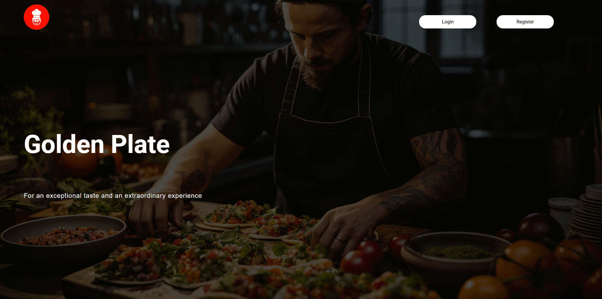

# 🍴 Interactive Restaurant Website with Database 🍴
A modern, responsive website designed for restaurants and cafes, featuring an interactive menu, reservation system, and sleek design. The system allows customers to log in, select a date and time for their visit, and optionally pre-order food. This way, their meal is prepared and ready for them by the time they arrive, ensuring they don’t have to wait while hungry.

## 🌟 Features

- **Interactive Menu**: Able to view dishes with prices and photos.
- **Online Reservation System**: Easy-to-use reservation form.
- **Fully Responsive Design**: Optimized for mobile, tablet, and desktop.
- **Modern Aesthetics**: Clean layout with smooth transitions between pages.

## 📸 Preview



## 🔧 Tech Stack

- **Frontend**: HTML, CSS, JavaScript
- **Backend**: JSP (Java Server Pages), Servlets
- **Server**: Apache Tomcat
- **Database**: MySQL (via XAMPP)
- **IDE**: NetBeans
- **Tools**: XAMPP (for MySQL and Apache)

## 🚀 Getting Started

### What's needed?

- **Netbeans 12.5**
- **jdk-14.0.2**
- **apache-tomcat-9.0.97**
- **XAMPP**

### Setup Instructions

 1. Clone the repository
    ```
    git clone https://github.com/yigithancetinkaye250/restaurant-website.git
    ```
2. Open the project in **Netbeans.**
3. Configure Apache Tomcat as the server in Netbeans.
4. Start **XAMPP** and ensure MySQL and Apache are running.
5. Import the database:
   - Open phpMyAdmin (via XAMPP)
   - Import the provided SQL file into the database.
6. Deploy the project on **Apache Tomcat** and run it:
   - Right-click the project in NetBeans and select **Run.**
